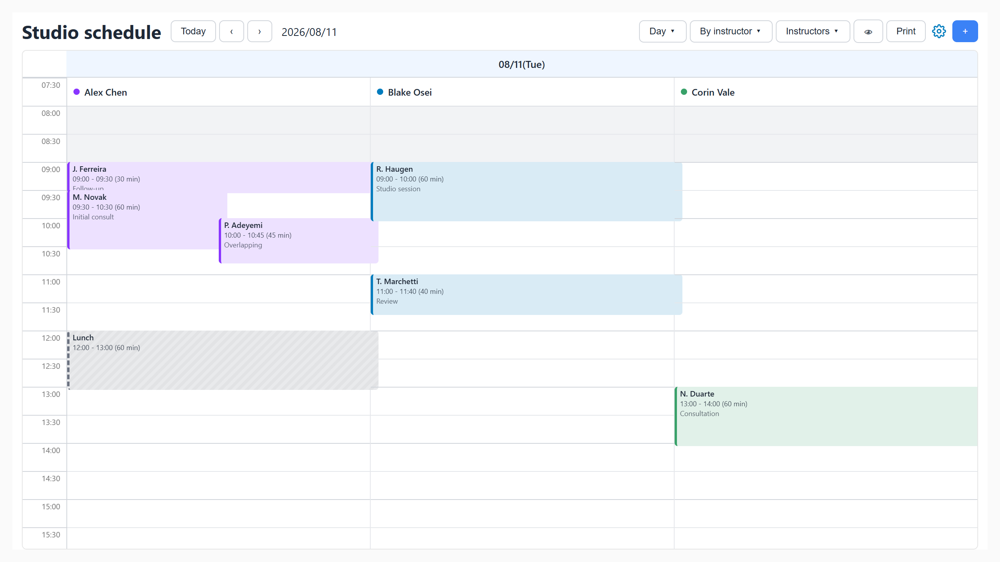

# SteadyCalendar

A resource-scheduling calendar for booking and appointment apps, in vanilla JavaScript with zero runtime dependencies.

Built for, and proven in, a commercial booking product at scale — then generalised, so the shape of your data and the words on screen are your choice, not the calendar's.

   



## Why this exists

Every off-the-shelf scheduling calendar meant taking on a large dependency and then working against its abstractions to get the booking behaviour the product actually needed: multi-resource columns, per-resource closed days, time blocks distinct from bookings, per-site business hours.

The trade was a bigger bundle in exchange for less control over the part of the product that mattered most. SteadyCalendar inverts it. The core owns state, date maths and event normalisation; rendering is a layer you can use, replace, or leave out. Zero runtime dependencies is a constraint the architecture is organised around, and CI asserts it — a test fails if anything from `node_modules` reaches the bundle.

## What it does

- Day, 3-day and week grids, one column per person, room or machine
- Month and list views
- Drag to move a booking between columns and times, drag its edge to resize, drag across empty slots to create
- Business-hours shading, closed days, public holidays, current-time indicator
- Time blocks (breaks, maintenance) distinct from bookings
- Resource filtering, privacy mode, persisted per-user view preferences
- Any field names, any language, any timezone

## Install

Not published to npm yet — `npm install steadycalendar` will 404. Build from source:

```bash
git clone https://github.com/Abw-0l0/steady-calendar.git
cd steady-calendar
npm install
npm run build
```

Then pack the workspace and install the tarball into your project:

```bash
npm pack -w packages/core          # -> steadycalendar-0.4.0.tgz
cd ../your-app
npm install ../steady-calendar/steadycalendar-0.4.0.tgz
```

| Entry point | Artifact |
|---|---|
| `import { CalendarApp } from 'steadycalendar'` | `dist/calendar.esm.js` |
| `require('steadycalendar')` | `dist/calendar.cjs` |
| `<script src="…/calendar.global.min.js">` → `window.SteadyCalendar` | self-contained, no loader |
| `import 'steadycalendar/styles'` | `dist/calendar.css` |
| `import { CalendarState } from 'steadycalendar/headless'` | state and data only, 8.7 kB gzip |

Node 18+ to build and test. Nothing to install at runtime.

## Quickstart

Verified against this tree — `tests/readme.test.js` executes it.

```js
import { CalendarApp } from 'steadycalendar';
import 'steadycalendar/styles';

const calendar = new CalendarApp({
  el: '#calendar',

  dataSource: {
    // Called once, cached 30 minutes.
    async fetchResources() {
      return {
        resources: [
          { id: 'a1', name: 'Alex Chen',  color: '#8935FF' },
          { id: 'a2', name: 'Blake Osei', color: '#007CBE' },
        ],
      };
    },
    // Called for the visible range, again when the date or view changes.
    async fetchEvents({ start, end }) {
      const res = await fetch(`/api/bookings?from=${start}&to=${end}`);
      return res.json();
    },
  },

  onSlotSelect({ date, startTime, endTime, resourceId }) {
    openBookingDialog({ date, startTime, endTime, resourceId });
  },
  onEventClick(event) {
    openBooking(event.sourceData);
  },
});

await calendar.init();
```

`init()` renders a day grid into `#calendar` and wires every gesture. The container needs a height — the calendar fills what it is given.

A booking:

```js
{ id: 'b1', date: '2026-08-11', start_time: '09:00', end_time: '09:30',
  assignee: { id: 'a1' }, client: { name: 'J. Ferreira' }, service: { name: 'Consultation' } }
```

Two defaults worth knowing, both overridable:

- **A `title` makes it a time block**, not a booking. The default `eventTypeResolver` is `raw => raw.title?.trim() ? 'timeblock' : 'event'`. A booking's label is built from the client and service names.
- **The assignee must be an object with an id.** A flat `assignee_id: 'a1'` is dropped in resource views.

Run `examples/index.html` for a working page with three columns, overlapping bookings, a time block and a live event log.

## Your field names

The library reads incoming data in exactly two places, through a declared map. If your API names things differently, say so once instead of reshaping your payload:

```js
new CalendarApp({
  fieldMap: {
    dataset: { resources: 'crew', secondaryResources: 'bays' },
    event:   { id: 'ref', date: 'on', startTime: 'from', endTime: 'to',
               owner: 'assignedTo', client: 'booker', service: 'job' },
    resource: { id: 'code', name: 'displayName', color: 'swatch' },
  },
})
```

A value is a name, an ordered list of candidates, or a function; names may be dotted paths (`'meta.ref.id'`). The first candidate resolving to a non-nullish value wins. Your entry **replaces** that key's default list rather than extending it, so a default can be removed — spread `DEFAULT_FIELD_MAP` to extend instead:

```js
event: { owner: ['assignedTo', ...DEFAULT_FIELD_MAP.event.owner] }
```

Entities are `dataset`, `event`, `resource`, `secondaryResource`, `client`, `service`. Anything you do not set keeps its default. `HEALTHCARE_FIELD_MAP` is exported for payloads using healthcare vocabulary — `therapist`, `patient`, `menu`, `booking_color` — so an existing integration migrates in one line.

If nothing resolves, the calendar logs which names it looked for and which your payload actually has, rather than rendering empty.

## Your language

`locale` formats dates and numbers. `translations` supplies strings. They are independent, so a language the library has never heard of works fine:

```js
import { JA_TRANSLATIONS } from 'steadycalendar';

new CalendarApp({ locale: 'ja-JP', translations: JA_TRANSLATIONS, /* … */ });

// or anything else
new CalendarApp({ translations: { today: 'Idag', listClient: 'Kund' }, /* … */ });
```

Every key falls back to its English default individually, so a partial map is safe. `DEFAULT_TRANSLATIONS` lists them all.

## Configuration

| Option | Type | Default | Description |
|---|---|---|---|
| `el` | `string \| HTMLElement` | `'#calendar'` | Container; a string goes to `querySelector`. |
| `dataSource` | `DataSource` | — | See below. |
| `fieldMap` | `FieldMap` | generic names | How incoming fields are read. |
| `headless` | `boolean` | `false` | Load data and manage state, render nothing. |
| `locale` | `string` | `'en-US'` | Date and number formatting. |
| `timezone` | `string` | system zone | IANA name used to resolve "today". Applies globally. |
| `translations` | `Record<string,string>` | English | Every user-visible string. |
| `eventTypeResolver` | `(raw) => 'timeblock' \| 'event'` | title present → timeblock | |
| `statusResolver` | `(raw) => { cancelled? }` | `status === 'Cancelled'` | |
| `plugins` | `CalendarPlugin[]` | `[]` | Registered before the first render. |
| `holidayProvider` | `HolidayProvider` | — | A registered plugin implementing `getHoliday` is adopted automatically. |
| `holidays` | `Record<string,string>` | — | Simpler source: a date-to-name map. |
| `preferences` | `{ fetch, save }` | — | Persists view, date, mode, filters. Needs `contextId`. |
| `cardDisplaySettings` | `CardDisplaySettings` | — | Which fields and badges a card shows. |
| `callbacks.resolveEventFields` | `(raw) => { textFields, badges }` | — | Main hook for card content. |
| `onEventClick` / `onSlotSelect` / `onDateHeaderClick` | function | — | |
| `onPrint` | `() => void` | `window.print()` | |

### DataSource

Function form wins; the URL form is a fallback.

| Field | Description |
|---|---|
| `fetchResources()` | Collections named per `fieldMap.dataset`. May also carry `businessHours`, `businessOverrides`, `holidaySettings`, `publicHolidays`. Cached 30 minutes. |
| `fetchEvents({ start, end })` | Raw events for the range. Cached 5 minutes per range. |
| `resourcesUrl` / `eventsUrl` | Used when the functions are absent. Events are fetched as `${eventsUrl}?start_date=…&end_date=…`. |

Secondary resources get a `resource-` id prefix so a room id cannot collide with a person's.

### Views and modes

| View | Duration | Resource columns |
|---|---|---|
| `resourceTimeGridDay` *(default)* | 1 day | yes |
| `resourceTimeGridThreeDay` / `resourceTimeGridWeek` | 3 / 7 days | yes |
| `timeGridDay` / `timeGridThreeDay` / `timeGridWeek` | 1 / 3 / 7 days | no |
| `dayGridMonth` | month | no |
| `list` | 7 days | no |

Resource modes: `staffView`, `resourceView`, `integratedView` (both), `flatView` (date columns). Grid geometry: 10-minute slots at 12 px, labelled every 30 minutes, across a full 24-hour day.

## API

| Object | Member | Description |
|---|---|---|
| `CalendarApp` | `init()` | Resolves the container, loads data, mounts the UI. Async. |
| | `destroy()` | Tears everything down; leaves the container empty. |
| `.state` | `setCurrentDate` / `setCurrentView` / `setCurrentResourceMode` | Trigger refetch and re-render. |
| | `setStaffFilters(ids)` / `setPrivacyMode(bool)` | |
| | `currentDate`, `events`, `resources`, `dateRange`, … | Read-only getters. |
| `.bus` | `on(event, handler)` | Returns an unsubscribe function. |
| `.dataBridge` | `refresh(refreshStatic?)` | Clears the cache and reloads. |

### Events

```js
calendar.bus.on('events:loaded', ({ events }) => { /* … */ });
```

| Event | Payload |
|---|---|
| `events:loaded` / `resources:loaded` | `{ events }` / `{ resources }` |
| `date:changed` / `view:changed` / `resource:changed` | `{ date }` / `{ view, resourceMode }` / `{ mode }` |
| `filter:changed` / `privacy:changed` / `loading:changed` | `{ staffIds }` / `{ enabled }` / `{ isLoading }` |
| `event:click` | `{ event, element }` |
| `event:drop` | `{ event, newDate, newTime, newResourceId, oldResourceId, revert }` |
| `event:resize` | `{ event, newEndTime, revert }` |
| `slot:select` / `slot:click` | `{ date, startTime, endTime, resourceId }` / `{ date, time, resourceId }` |
| `dateHeader:click` / `title:updated` | `{ date }` / `{ title }` |
| `data:refresh` | emit this to force a reload |

`revert()` restores the element — call it to reject a change. The container also receives a bubbling `sc:slot:select` DOM event.

### The normalised event

Renderers never see your raw shape. Each event carries `resourceOwnerId`, `resourceOwnerName`, `clientName`, `serviceName`, `groupId`, `ignoresResourceFilter`, and `sourceData` — the untouched original, for your callbacks.

### Exports

`CalendarApp`, `EventBus`, `CalendarState`, `DataBridge`, `PreferencesBridge`, `EventMapper`, `PluginManager`; the `temporal`, `ColorUtils` and `holidays` namespaces; `DEFAULT_FIELD_MAP`, `HEALTHCARE_FIELD_MAP`, `DEFAULT_TRANSLATIONS`, `JA_TRANSLATIONS`, `translate`; and the grid constants.

The rendering classes are exported too — `ViewManager`, `CalendarToolbar`, `EventRenderer`, the four views and the five interaction handlers — so you can compose your own shell. Each takes `(state, bus, config)` and exposes `init(container)` / `destroy()`. Internal column builders are deliberately not exported; their contracts are not stable.

## Recipes

### Persisting a drag

```js
calendar.bus.on('event:drop', async ({ event, newDate, newTime, newResourceId, revert }) => {
  try {
    await fetch(`/api/bookings/${event.id}`, {
      method: 'PATCH',
      headers: { 'Content-Type': 'application/json' },
      body: JSON.stringify({ date: newDate, start_time: newTime, assignee_id: newResourceId }),
    });
    calendar.bus.emit('data:refresh');
  } catch {
    revert();
  }
});
```

`steadycalendar-pro` packages this as `DragPersistencePlugin`, with `canDrop` / `canResize` guards.

### Computing free slots headlessly

```js
import { EventBus, CalendarState, DataBridge, temporal, SLOT_INTERVAL }
  from 'steadycalendar/headless';

const { convertTimeToMinutes, convertMinutesToTime } = temporal;

function freeSlots(events, resourceId, { open = '09:00', close = '17:00', duration = 30 } = {}) {
  const busy = events
    .filter((e) => e.resourceId === resourceId && !e.isCancelled)
    .map((e) => [convertTimeToMinutes(e.startTime), convertTimeToMinutes(e.endTime)]);

  const slots = [];
  for (let t = convertTimeToMinutes(open); t + duration <= convertTimeToMinutes(close); t += SLOT_INTERVAL) {
    if (!busy.some(([s, end]) => t < end && t + duration > s)) slots.push(convertMinutesToTime(t));
  }
  return slots;
}

const bus = new EventBus();
const state = new CalendarState(bus);
const data = new DataBridge(state, bus, { dataSource });
data.init();

bus.on('events:loaded', ({ events }) => console.log(freeSlots(events, 'a1')));
await data.loadEvents();
```

Time blocks occupy slots exactly like bookings, so breaks are excluded for free.

## Accessibility

**The calendar is pointer-driven today.** Events are not keyboard focusable, carry no role or accessible name, and there is no keyboard equivalent for moving, resizing or creating them. Toolbar buttons are reachable because they are native `<button>` elements; the grid is not.

This is a known gap with a sequenced roadmap in [ACCESSIBILITY.md](ACCESSIBILITY.md). If keyboard access is a requirement for you, read that first.

## Browser support

Compiled to **ES2020**, using `ResizeObserver` and `CustomEvent` (both guarded) and `Intl.DateTimeFormat` with `formatToParts`. Floor is roughly Chrome 84, Edge 84, Firefox 79, Safari 14.

Dates use a small internal implementation over native `Date` and `Intl` — not `Temporal`, not a polyfill. All arithmetic runs on a UTC epoch, so a day is a day across every DST boundary; the suite runs under six timezones in CI, from UTC+14 to UTC−11.

## Bundle size

From a clean `npm run build`, gzip level 9:

| Artifact | Raw | Gzip |
|---|---|---|
| `calendar.global.min.js` — everything, `<script>`-ready | 111.9 kB | **26.7 kB** |
| `calendar.esm.min.js` — everything, for bundlers | 111.4 kB | 26.5 kB |
| `calendar.headless.min.js` — state and data only | 26.8 kB | 8.7 kB |
| `calendar.css` | 28.4 kB | 5.0 kB |

Reproduce with `npm run size -w packages/core`. The build fails if the browser bundle passes 40 kB gzip.

## Testing

```bash
npm test              # 250 tests
npm run lint
npm run check:imports # resolves every module, not just what index.js reaches
npm run test:smoke    # loads the <script> artifact in a bare context
```

Several guards exist because of specific failures this codebase had:

- **`temporal.differential.test.js`** compares the date implementation against `@js-temporal/polyfill` — a dev-only oracle — across ~18,600 dates. `Jan 31 + 1 month` is `Feb 28`; naive arithmetic gives `Mar 3`.
- **`graph.test.js`** asserts every module is reachable from the entry point, that nothing from `node_modules` is in the bundle, and that **no renderer references a raw incoming field name**. The last one is why the resource filter silently stopped filtering and two list columns were permanently blank: raw-shape knowledge had leaked out of the mapper.
- **`types.test.js`** asserts every runtime export is declared, and that the headless entry does not declare `CalendarApp` — which would let TypeScript accept an import that fails at runtime.
- **`check:imports`** makes every file an entry point, because the normal build resolves only one.

CI runs build, lint, typecheck, tests and both artifact checks on Node 18/20/22 across Linux, Windows and macOS, plus the whole suite under six timezones, coverage, and CodeQL.

jsdom has no layout engine, so it proves structure, not appearance. `examples/index.html` is the human check.

## Packages

| Package | Contents |
|---|---|
| `packages/core` — `steadycalendar` | The calendar. Zero runtime dependencies. |
| `packages/pro` — `steadycalendar-pro` | `DragPersistencePlugin` and `JapaneseHolidayProvider`. Depends on `@holiday-jp/holiday_jp`. |

Both MIT.

## Contributing

See [CONTRIBUTING.md](CONTRIBUTING.md). In short: modules take `(state, bus, config)` and expose `init` / `destroy`, they talk through the `EventBus` rather than to each other, every subscription is unsubscribed in `destroy`, raw field names are read only in `EventMapper` and `CalendarApp._buildResources`, and date logic goes through `utils/temporal.js` — `new Date(y, m, d)` is banned by the lint config because local-time construction is unsafe in zones that shift at midnight.

## License

MIT. See [LICENSE](LICENSE).
